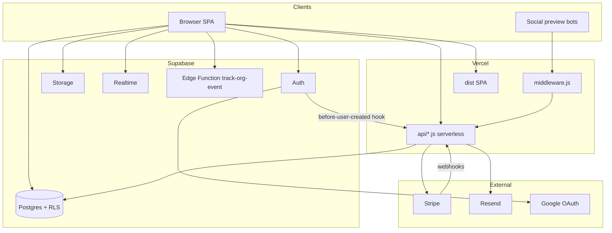

# CenterLinked Architecture

Senior-engineer onboarding document for the production CenterLinked application as it exists today. This describes systems, file paths, dependencies, and blast radius — not a roadmap.

**Stack summary:** Vite + React 18 SPA · React Router 6 · Supabase (Auth, Postgres, RLS, Storage, Realtime, Edge Functions) · Stripe Billing · Resend email · Vercel (static SPA + serverless `api/` + middleware). There are **no Next.js Server Actions**.

**Feature flags:** `FEATURES.community = false` in `src/config/features.ts` — Feed and Messenger routes exist but redirect to `/app`. **Billing soft-gate:** inactive subscriptions show a dismissible banner; the app remains usable during early access.

---

## 1. Application Structure

### Purpose
Organize a multi-tenant behavioral-health referral platform: organizations own facilities and insurance contracts; authenticated users search verified in-network capacity; public org/program sheets act as shareable referral profiles.

### Top-level layout

| Path | Role |
|------|------|
| `src/` | React SPA source |
| `src/pages/` | Route-level screens (landing, auth, app, public, admin) |
| `src/components/` | UI by domain: `app/`, `admin/`, `facility/`, `public/`, `landing/`, `auth/`, `ui/`, `legal/` |
| `src/contexts/` | `AuthContext` (session, profile, roles) |
| `src/hooks/` | Small data hooks (`useReferralNetwork`, `useOrgTeamMembers`, etc.) |
| `src/lib/` | Domain helpers (billing, org setup, payers, verification, email client wrappers) |
| `src/integrations/supabase/` | Typed Supabase client + generated `types.ts` |
| `src/config/features.ts` | Feature flags |
| `api/` | Vercel serverless HTTP entrypoints (thin wrappers) |
| `server/` | Shared Node handlers used by Vite plugins (local) and `api/` (prod) |
| `supabase/` | SQL scripts / hardening / billing / RLS (applied via Dashboard or CLI) |
| `vite.config.ts` + `vite-plugin-*.ts` | Dev server + local API middleware |
| `vercel.json` | SPA rewrite; OG function includes `dist/index.html` |
| `middleware.js` | Vercel edge: social-preview bots → `/api/og` |
| `public/` | Static assets (`robots.txt`, `sitemap.xml`, logos) |

### Boot sequence
1. `src/main.tsx` — if OAuth tokens land on `/` hash, rewrite to `/auth/callback`; else mount `<App />`.
2. `src/App.tsx` — `AppErrorBoundary` → `TooltipProvider` → Sonner toaster → Vercel Analytics → `BrowserRouter` → `AuthProvider` → routes.
3. Authenticated app shell: `ProtectedRoute` → `AppLayout` → nested `<Outlet />` pages.

### Primary files
- `package.json`, `vite.config.ts`, `src/main.tsx`, `src/App.tsx`, `src/index.css`, `tailwind.config.ts`

### Dependencies
- React 18, react-router-dom, @supabase/supabase-js, @tanstack/react-query (listed but **not wired** in the SPA today), Radix/shadcn-style UI, motion, zod (server email validation), stripe (server), papaparse (CSV/PDF upload flows), sharp (facility-images tooling).

### Potential impact if modified
Changing bootstrap, aliases (`@` → `src`), or Vite plugins breaks local API parity with production. Changing `vercel.json` rewrites can break SPA deep links or isolate `/api/*` incorrectly.

---

## 2. Routing Structure

### Purpose
Map public marketing, auth, public share URLs, org onboarding, and the authenticated `/app/*` product (including super-admin routes).

### Route map (`src/App.tsx`)

**Public / marketing**
- `/` — landing (`pages/Index.tsx`)
- `/login`, `/signup`, `/auth/callback`
- `/request-access`
- `/privacy`, `/terms`
- `/o/:orgSlug/p/:programSlug`, `/p/:slug` — program (facility) sheets
- `/o/:slug` — organization sheet
- `/:slug` — short org slug (catch-all before `*`)
- `*` — `NotFound`

**Authenticated (org optional)**
- `/setup-organization`, `/create-organization` — `ProtectedRoute` only

**Authenticated app (`/app` → `AppLayout`)**
- `/app`, `/app/dashboard` — dashboard
- `/app/search`, `/app/search/results`
- `/app/network` → redirect to `/app/organizations`
- `/app/organizations` — referral network + directory
- `/app/facilities`, `/app/facilities/:id`, `/app/facilities/:id/verify`
- `/app/facilities/new` → onboarding; `/app/facilities/upload-pdf`
- `/app/onboarding`, `/app/members`, `/app/settings`, `/app/billing`
- `/app/verifications` — `AdminRoute` (super_admin)
- Admin: `/app/admin/insurance`, `requests`, `join-requests`, `claims`, `organizations`, `organizations/new`, `organizations/:id`
- **Community (flagged):** when `FEATURES.community` is true → `/app/feed`, `/app/messages`; when false → both redirect to `/app`

### Guards
- `ProtectedRoute` — requires session; non–super-admins without `profile.organization_id` redirect to `/setup-organization` (except org-optional paths).
- `AdminRoute` — requires `super_admin` role; otherwise `SuperAdminAccessDenied`.

### Primary files
- `src/App.tsx`, `src/components/ProtectedRoute.tsx`, `src/components/app/AppLayout.tsx`, `src/config/features.ts`

### Dependencies
React Router; AuthContext roles/profile.

### Potential impact if modified
Route order matters: `/:slug` must stay after `/app` and reserved paths. Changing community flag routes without updating nav/deep links leaves dead URLs. Admin route wrapping mistakes expose admin UIs (RLS still applies server-side).

---

## 3. Database Architecture

### Purpose
Postgres (Supabase) is the system of record for tenants, facilities, insurance contracts, authz roles, messaging/posts (dormant UI), billing columns, and intake leads. Access is enforced primarily via **RLS** and **SECURITY DEFINER RPCs**.

### Tables (from `src/integrations/supabase/types.ts`)

| Table | Domain |
|-------|--------|
| `organizations` | Tenant profile, branding, BD contacts, Stripe billing fields, `verified` |
| `facilities` | Programs under an org; verification, images, BD contacts, preferred provider |
| `insurance_contracts` | Facility ↔ payer in-network rows (`payer_id`, `payer_name`) |
| `payers` | Master insurance list (`payer_status`: pending/approved/rejected) |
| `profiles` | User profile linked to `auth.users` + optional `organization_id` |
| `user_roles` | App roles: `super_admin` \| `facility_admin` \| `bd_rep` |
| `organization_members` | Membership + `role_at_org` |
| `org_invites` | Pending email invites |
| `organization_join_requests` | Domain-matched join workflow |
| `organization_claims` | Public claim-of-ownership requests |
| `referral_network` | Owner org → partner org preferences |
| `contract_verifications` | Verification audit actions |
| `verification_reminders` | Stale-contract reminder records |
| `preferred_provider_changes` | Preferred-provider audit |
| `org_analytics_events` | Engagement events (also via edge function) |
| `early_access_leads` | Access-request intake |
| `approved_personal_emails` | Personal-email allowlist exceptions |
| `stripe_webhook_events` | Webhook idempotency |
| `conversations`, `conversation_participants`, `messages` | DMs (UI feature-flagged off) |
| `posts`, `post_likes` | Community feed (UI feature-flagged off) |

Enums: `app_role`, `payer_status`, `verification_status`.

### Key RPCs
- Auth/org: `is_email_auth_allowed`, `email_signup_eligible`, `bootstrap_super_admin`, `is_bootstrap_admin_candidate`, `claim_pending_org_invite`, `get_org_setup_options`, `create_organization_with_owner`, `admin_create_organization`, `link_user_to_organization`, `request_to_join_organization`, `review_organization_join_request`, `list_org_join_requests`, `list_superadmin_join_requests`
- Authz helpers: `has_role`, `is_org_member`, `is_org_facility_admin`, `get_user_org`, `get_networked_org_ids`
- Facilities: `save_facility_with_contracts`, `freeze_stale_facilities`, `list_facilities_due_for_verification`
- Orgs: `update_organization_profile`, `get_org_engagement_stats`, `slugify`
- Messaging: `get_or_create_direct_conversation`, `is_conversation_participant`
- Email/access: `approve_personal_email`, `consume_access_request_rate_limit` (SQL script)

### SQL script inventory (`supabase/`)
Applied operationally (not always via a single migration runner):
- `migrations/20260802120000_production_security_bundle.sql` — ordered apply checklist
- `rls-tenant-hardening.sql`, `security-hardening.sql`, `revoke-dangerous-grants.sql`
- `save-facility-with-contracts.sql`, `org-billing.sql`, `stripe-webhook-events.sql`
- `approved-personal-emails.sql`, `bootstrap-super-admin.sql`, `org-join-requests.sql`
- `access-request-intake-hardening.sql`, facility visibility / social / footer image scripts
- `migrations/00000000000000_rls_policy_snapshot.json` — live policy inventory (~75 policies)

### Storage buckets (client usage)
`facility-images`, `org-logos`, `avatars`, `post-images` — uploads via `ImageUploader` → public URLs.

### Primary files
- `src/integrations/supabase/types.ts`, `src/integrations/supabase/client.ts`, `supabase/*.sql`

### Dependencies
Supabase Postgres + RLS; service role used only in `server/` and rate-limited intake.

### Potential impact if modified
Schema/RPC/RLS changes affect every client query and serverless path. Breaking `save_facility_with_contracts` or role helpers can lock orgs out of writes or open cross-tenant reads. Never expose `SUPABASE_SERVICE_ROLE` via `VITE_*` (enforced in `vite.config.ts`).

---

## 4. Authentication Flow

### Purpose
Authenticate work-email users (password + Google OAuth), create profiles, optionally bootstrap super-admin, claim invites, and block personal emails unless approved.

### Flows

**Email/password**
1. `Login` / `Signup` call `isEmailAuthAllowed` (RPC) before `signInWithPassword` / `signUp`.
2. Supabase Auth issues session; client persists PKCE session in `localStorage`.
3. `AuthProvider` `onAuthStateChange` → `ensureProfile` → `bootstrapSuperAdmin` → `claimPendingOrgInvite` → load `profiles` + `user_roles`.
4. `notifyAuthEvent("login"|"signup")` → `/api/notify-auth-event` (fire-and-forget).

**Google OAuth**
1. `signInWithGoogle` (`src/lib/google-auth.ts`) → Supabase Google provider → `/auth/callback`.
2. `AuthCallback` re-checks email allowlist / bootstrap; redirects to `/setup-organization` or `/app`.
3. `main.tsx` recovers hash tokens mistakenly delivered to `/`.

**Before User Created hook (server)**
- Supabase Auth Hook → `POST /api/auth-before-user-created`
- Verifies Standard Webhooks signature (`BEFORE_USER_CREATED_HOOK_SECRET`)
- Calls `is_email_auth_allowed` with service role; rejects personal emails not approved

**Client fail-closed**
- Personal domains listed in `src/lib/email-domains.ts`; AuthContext signs out disallowed sessions after login.

### Primary files
- `src/contexts/AuthContext.tsx`, `src/pages/Login.tsx`, `src/pages/Signup.tsx`, `src/pages/AuthCallback.tsx`
- `src/lib/ensure-profile.ts`, `src/lib/email-domains.ts`, `src/lib/bootstrap-admin.ts`, `src/lib/google-auth.ts`
- `server/auth/handlers/before-user-created.mjs`, `api/auth-before-user-created.js`, `vite-plugin-auth-hook.ts`
- `supabase/bootstrap-super-admin.sql`, `supabase/approved-personal-emails.sql`

### Dependencies
Supabase Auth; Resend for auth notification emails; Google OAuth configured in Supabase Dashboard (see `.env.example`).

### Potential impact if modified
Auth gate bugs either lock out legitimate work users or admit personal emails. Hook signature/env misconfiguration blocks all signups. Changing PKCE/storage settings can break session persistence.

---

## 5. Authorization

### Purpose
Layer client route guards with Postgres RLS and SECURITY DEFINER RPCs so tenants cannot read/write across organizations.

### App roles (`user_roles.role`)
- `super_admin` — platform admin; `AdminRoute`; broad RLS via `has_role`
- `facility_admin` — org admin (billing, members, org profile); treated as admin alongside super_admin in AuthContext (`isFacilityAdmin`)
- `bd_rep` — business-development role at app level (membership `role_at_org` is separate string on `organization_members`)

### Client enforcement
- `ProtectedRoute` / `AdminRoute`
- UI conditionals: billing nav, Members join-request review, facility visibility toggles, public sheet edit dialogs (`profile.organization_id === facility.organization_id` or super_admin)

### Server / DB enforcement
- RLS policies (tenant hardening: anon sees verified orgs only; profiles limited to self/org/admin)
- `user_roles` insert/update/delete restricted to existing super_admins (bootstrap via SECURITY DEFINER RPC)
- Billing APIs: `assertOrgBillingAdmin` requires Bearer JWT + `facility_admin` or `super_admin` + `organization_id`
- Facility writes: `save_facility_with_contracts` checks super_admin / facility_admin / org member

### Primary files
- `src/components/ProtectedRoute.tsx`, `src/contexts/AuthContext.tsx`
- `supabase/rls-tenant-hardening.sql`, `supabase/security-hardening.sql`
- `server/stripe/supabase.mjs` (`assertOrgBillingAdmin`)

### Dependencies
`has_role`, `is_org_member`, `is_org_facility_admin` RPCs; AuthContext role load.

### Potential impact if modified
Weakening RLS or RPC checks is a cross-tenant data exposure. Client-only guard changes are insufficient — always verify RLS. Tightening incorrectly can brick org admins out of Settings/Facilities/Billing.

---

## 6. Organizations

### Purpose
Tenant root: branding, public mini-homepage, membership, referral network, billing, and ownership of facilities.

### Lifecycle
1. **Setup:** `/setup-organization` — `get_org_setup_options` (domain match), request join, or navigate to create.
2. **Create:** `/create-organization` → RPC `create_organization_with_owner`.
3. **Admin create:** `/app/admin/organizations/new` → `admin_create_organization`.
4. **Join:** invites (`org_invites` + `claim_pending_org_invite`) or join requests + review.
5. **Claim:** public `OrgClaimCard` / `ClaimOrganizationDialog` → `organization_claims` (admin review).
6. **Profile/branding:** Settings + admin workspace call `update_organization_profile`; public sheet at `/o/:slug` or `/:slug`.
7. **Network:** `referral_network` via `useReferralNetwork` on Organizations page.

### Primary files
- Pages: `SetupOrganization.tsx`, `CreateOrganization.tsx`, `Organizations.tsx`, `Settings.tsx`, `pages/public/OrgSheet.tsx`, admin org pages
- Lib: `src/lib/org-setup.ts`, `org-public-select.ts`, `org-hero.ts`, `public-urls.ts`, `track-org-event.ts`
- Components: `OrgDashboard`, `OrganizationSheetView`, `AdminOrgBrandingForm`, `OrgSharedLinksPanel`, `AddPartnerOrgDialog`

### Dependencies
Supabase orgs/members/claims RPCs; analytics via `supabase.functions.invoke("track-org-event")`; OG meta for share URLs.

### Potential impact if modified
Slug/URL helpers affect all public links and OG middleware. Org RPC changes affect onboarding and admin provisioning. Breaking branding fields breaks public sheets and Settings.

---

## 7. Facilities

### Purpose
Represent treatment programs (locations) under an organization: clinical metadata, images, insurance contracts, verification status, and public program sheets.

### Key behaviors
- Create/edit via dialogs + `saveFacilityWithContracts` → RPC `save_facility_with_contracts` (atomic facility + contracts).
- Onboarding batch (`Onboarding.tsx`) and PDF/CSV upload (`PdfFacilityUpload.tsx`).
- Verification: `verification_status` pending/approved/rejected; monthly contract freshness (`contracts_verified_at`, `verification_frozen`); verify UI at `/app/facilities/:id/verify`.
- Public program sheet: `/o/:orgSlug/p/:programSlug` or `/p/:slug`.
- Visibility: `hidden_from_org_page` for public org page listing.
- Preferred provider flags managed in Verifications admin UI.
- Offline/ops tooling: `server/facility-images/*` batch pipeline; `approve-all-facilities.mjs`, `reconcile-facility-contracts.mjs`.

### Primary files
- Pages: `Facilities.tsx`, `FacilityDetail.tsx`, `Onboarding.tsx`, `VerifyContracts.tsx`, `PdfFacilityUpload.tsx`, `pages/public/ProgramSheet.tsx`
- Components: `src/components/app/facility/*`, `FacilitySheetView`, `FacilityGridCard`
- Lib: `src/lib/save-facility.ts`, `verification.ts`
- SQL: `supabase/save-facility-with-contracts.sql`, facility-visibility SQL scripts

### Dependencies
`payers` / `insurance_contracts`; Storage `facility-images`; org membership for writes.

### Potential impact if modified
Corrupt contract saves break Search (core product). Verification field semantics affect search filters (`approved` + not frozen). Slug changes break public share URLs and OG previews.

---

## 8. Insurance Networks

### Purpose
Canonical payer database plus per-facility in-network contracts that power search and public insurance lists.

### Model
- `payers` — approved master list (aliases, category, parent company, status).
- `insurance_contracts` — links facility to payer (`payer_id` optional; free-text `payer_name` retained).
- Matching logic: `src/lib/match-payer.ts` (+ server twin `server/lib/match-payer.mjs`) normalizes names/aliases for search and backfills.
- Admin UI: `InsuranceDatabase.tsx`, `PayerEditDrawer.tsx`.
- Ops scripts: `backfill-payer-ids.mjs`, `seed-missing-payers.mjs`, `reconcile-facility-contracts.mjs`.

### Search usage
Search queries `insurance_contracts` with `in_network = true`, joins approved non-frozen facilities, filters by payer OR-filter, state, city, level of care; client re-filters with `contractMatchesPayer`.

### Primary files
- `src/pages/app/admin/InsuranceDatabase.tsx`, `src/lib/match-payer.ts`, `src/lib/load-approved-payers.ts`
- `src/components/app/facility/PayerCombobox.tsx`, `EditInsuranceContractsDialog.tsx`

### Dependencies
Facility verification status; approved payers for comboboxes (`approvedOnly`).

### Potential impact if modified
Payer matching changes alter search recall/precision platform-wide. Unapproved payers leaking into search pollute results. Reconcile scripts with `--apply` rewrite production contract links.

---

## 9. Business Development Contacts

### Purpose
Surface who to call for referrals — org-level and facility-level BD contact fields used on public sheets and network cards.

### Data
- Org: `organizations.bd_contact_name|phone|email` (Settings, admin branding, OrgHeroContactCard).
- Facility: `facilities.bd_contact_*` — assigned via `FacilityBdRepFields` / `AssignFacilityBdDialog` from org team members (`useOrgTeamMembers`) or manual override; denormalized onto the facility for public display.

### Primary files
- `FacilityBdRepFields.tsx`, `AssignFacilityBdDialog.tsx`, `OrgHeroContactCard.tsx`
- Settings / AdminOrgBrandingForm BD fields
- `useOrgTeamMembers.ts`

### Dependencies
`organization_members` + `profiles`; public sheet components; `trackOrgEvent` for contact click analytics.

### Potential impact if modified
Broken assignment UX leaves public sheets without contacts. Changing field names without SQL/RPC alignment breaks `save_facility_with_contracts` and `update_organization_profile`.

---

## 10. Messaging

### Purpose
Direct messaging between users (conversations/messages with Realtime). **Present in codebase but feature-flagged off** (`FEATURES.community = false`).

### Behavior (when enabled)
- Route `/app/messages` → `Messenger.tsx`
- Lists via `conversation_participants` + `conversations` + `messages`
- Start DM: RPC `get_or_create_direct_conversation`
- Realtime channel `messenger-rt` on `messages` INSERT
- Unread via `last_read_at`

### Primary files
- `src/pages/app/Messenger.tsx`
- DB: `conversations`, `conversation_participants`, `messages` + RPCs in types
- Flag: `src/config/features.ts`, routes in `App.tsx`

### Dependencies
Supabase Realtime; profile visibility RLS (participants must be readable).

### Potential impact if modified
Enabling the flag without verifying RLS/Realtime policies can expose messages. Schema changes while flag is off still affect DB; coordinate before flipping `FEATURES.community`.

---

## 11. Notifications

### Purpose
Transactional email and in-app toast feedback — not a push/notification center.

### Channels

| Channel | Mechanism |
|---------|-----------|
| Toasts | Sonner (`toast.*`) for UX errors/success |
| Access request | `POST /api/notify-access-request` → insert `early_access_leads` + Resend to `ADMIN_NOTIFY_EMAIL` |
| Auth events | `POST /api/notify-auth-event` (Bearer) — signup/login notices |
| Org welcome | `POST /api/send-welcome` (Bearer, super-admin path) |
| Stripe DFY | Webhook sends admin email on Done For You purchase |
| Verification reminders | `verification_reminders` table (data model; admin Verifications UI) |
| Billing soft-gate | `BillingStatusBanner` in-app (not email) |

### Primary files
- Client: `src/lib/transactional-email.ts`
- Server: `server/email/*` (`send.mjs`, `templates.mjs`, handlers)
- API: `api/notify-access-request.js`, `notify-auth-event.js`, `send-welcome.js`
- Local: `vite-plugin-email-api.ts`

### Dependencies
Resend (`RESEND_API_KEY`, `EMAIL_FROM`, `ADMIN_NOTIFY_EMAIL`); rate-limit RPC for access requests.

### Potential impact if modified
Email handler failures should remain non-blocking for auth UX. Intake API changes affect spam/abuse resistance. Template/from-domain misconfig breaks deliverability.

---

## 12. Search

### Purpose
Core product: find organizations/facilities with verified in-network insurance contracts by payer, geography, and level of care.

### Flow
1. `/app/search` → `SearchForm` collects payer/state/city/LOC → navigates to `/app/search/results?...`
2. `SearchResults` queries `insurance_contracts` ⨝ `facilities` ⨝ `organizations` (limit 500), filters approved + not frozen, groups by org.
3. Marks `in_your_network` via `useReferralNetwork`.
4. Broader directory: `/app/organizations` with similar contract/facility filtering + network tab.
5. `/app/facilities` — approved facility directory with client-side filters.

### Primary files
- `src/pages/app/Search.tsx`, `SearchResults.tsx`
- `src/components/app/search/SearchForm.tsx`, `OrgResultCard.tsx`, `VerificationBadge.tsx`
- `src/lib/match-payer.ts`, `src/hooks/useReferralNetwork.ts`

### Dependencies
Approved payers; facility verification fields; RLS on contracts/facilities.

### Potential impact if modified
Search is the primary authenticated value path — query shape, limits, and verification filters change product accuracy. Payer OR-filter bugs cause false negatives.

---

## 13. Profile Management

### Purpose
Maintain the signed-in user’s profile and (for admins) the organization’s public profile/branding.

### User profile
- Table `profiles` (full_name, job_title, phone, avatar_url, organization_id, email)
- Created by `ensureProfile` on first auth
- Edited in `Settings.tsx` (direct `profiles` update + `avatars` storage via `ImageUploader`)
- `AuthContext.refresh()` reloads profile/roles

### Organization profile
- Settings (facility_admin / super_admin) → `update_organization_profile` RPC
- Fields: name, description, website, HQ, logo, footer image, social URLs, BD contacts, brand/accent colors, cover/gallery images, announcement, program badges, CTAs, why_refer
- Super-admin workspace: `AdminOrgWorkspace` + `AdminOrgBrandingForm`

### Primary files
- `src/pages/app/Settings.tsx`, `src/lib/ensure-profile.ts`, `src/components/app/ImageUploader.tsx`
- Admin: `AdminOrgWorkspace.tsx`, `AdminOrgBrandingForm.tsx`

### Dependencies
Storage buckets; org RPCs; AuthContext.

### Potential impact if modified
Profile insert policy mistakes block signup completion. Org profile RPC payload shape is shared by Settings and admin — skew breaks one or both UIs.

---

## 14. Admin Functions

### Purpose
Super-admin operations for platform curation: orgs, claims, access leads, join requests, insurance DB, facility/payer verification, preferred providers.

### Surfaces (`adminLinks` in `SuperAdminPanel.tsx`)
- Manage organizations / Add organization / Org workspace
- Join requests (`JoinRequests.tsx` — platform-wide)
- Access requests (`AccessRequests.tsx` — `early_access_leads`)
- Org claims (`OrganizationClaims.tsx`)
- Verifications (`Verifications.tsx` — facilities, payers, freshness, preferred providers)
- Insurance DB (`InsuranceDatabase.tsx`)

### Bootstrap
- Emails in `bootstrap_admin_emails` (server-only table)
- RPC `bootstrap_super_admin` / `is_bootstrap_admin_candidate`
- UI: `SuperAdminSetupAlert` when candidate but role not yet granted

### Primary files
- `src/components/app/admin/*`, `src/pages/app/admin/*`, `src/pages/app/Verifications.tsx`
- `supabase/bootstrap-super-admin.sql`

### Dependencies
`AdminRoute`; service-side welcome email; RLS admin policies.

### Potential impact if modified
Admin pages perform privileged updates — bugs can approve wrong facilities/payers or attach users to wrong orgs. Bootstrap allowlist exposure would be a privilege-escalation risk (currently server-side only).

---

## 15. API Routes

### Purpose
Vercel serverless endpoints for concerns that must not run in the browser: Stripe, Resend email, Auth Hook, OG HTML for crawlers.

### Endpoints (`api/*.js` → `server/**` handlers)

| Route | Method | Auth | Handler |
|-------|--------|------|---------|
| `/api/auth-before-user-created` | POST | Webhook signature | `server/auth/handlers/before-user-created.mjs` |
| `/api/create-checkout-session` | POST | Bearer JWT | `server/stripe/handlers/create-checkout-session.mjs` |
| `/api/create-portal-session` | POST | Bearer JWT | `server/stripe/handlers/create-portal-session.mjs` |
| `/api/billing-overview` | GET | Bearer JWT | `server/stripe/handlers/billing-overview.mjs` |
| `/api/stripe-webhook` | POST | Stripe signature (raw body) | `server/stripe/handlers/webhook.mjs` |
| `/api/notify-access-request` | POST | Rate-limited public | `server/email/handlers/notify-access-request.mjs` |
| `/api/notify-auth-event` | POST | Bearer JWT | `server/email/handlers/notify-auth-event.mjs` |
| `/api/send-welcome` | POST | Bearer JWT | `server/email/handlers/send-welcome.mjs` |
| `/api/og` | GET | none (`?path=`) | `server/og-meta.mjs` via `api/og.js` |

### Local parity
Vite plugins mount the same handlers during `npm run dev`:
- `vite-plugin-stripe-api.ts`
- `vite-plugin-email-api.ts`
- `vite-plugin-auth-hook.ts`
- `vite-plugin-social-preview.ts` (bot UA only; does not intercept normal browsers)

### Edge middleware
`middleware.js` — for social preview bots on public share paths, rewrite to `/api/og?path=...`.

### Primary files
- `api/*`, `server/**`, `vite-plugin-*.ts`, `middleware.js`, `vercel.json`

### Dependencies
Env vars documented in `.env.example` (Stripe, Resend, Supabase service role, hook secret, `SITE_URL`).

### Potential impact if modified
Mismatched local plugin vs `api/` wrapper causes “works in prod / fails locally” bugs. Disabling raw body on Stripe webhook breaks signature verification. OG cache headers and path matching affect link unfurls on LinkedIn/Slack/etc.

---

## 16. Server Actions

### Note
This is **not** a Next.js app. There are **no Server Actions**. Server-side work uses the patterns below.

### Actual server-side patterns

1. **Vercel serverless functions** in `api/*.js` — Node request handlers importing shared logic from `server/`.
2. **Shared handlers** in `server/` — Stripe, email, auth hook, OG meta, CLI batch jobs (`.mjs`).
3. **Vite `configureServer` middleware** — local equivalents of `/api/*` during development.
4. **Supabase RPC / SECURITY DEFINER functions** — privileged multi-table writes invoked from the SPA with the user JWT (e.g. `save_facility_with_contracts`, org setup RPCs).
5. **Supabase Edge Function** — `track-org-event` invoked from `src/lib/track-org-event.ts` (analytics; failures swallowed).
6. **Vercel middleware** — bot rewrite for OG HTML.
7. **Direct Supabase client calls from the browser** — majority of CRUD under RLS (not “server actions”).

### Client wrappers that call APIs
- `src/lib/billing.ts` → checkout / portal / overview
- `src/lib/transactional-email.ts` → notify / welcome / auth emails

### Potential impact if modified
Treat `server/` as the single source of truth for API business logic. Duplicating logic only in `api/` or only in a Vite plugin breaks environment parity.

---

## 17. Reusable Components

### Purpose
Shared UI primitives and domain components used across landing, app, public sheets, and admin.

### By folder

| Folder | Contents |
|--------|----------|
| `src/components/ui/` | shadcn/Radix primitives: button, dialog, sheet, select, tabs, command, etc. |
| `src/components/app/` | App shell pieces: `AppLayout`, `OrgDashboard`, `BillingStatusBanner`, `ImageUploader`, `ShareSheetButton`, `OrgBillingCard`, `OrgSharedLinksPanel` |
| `src/components/app/facility/` | Facility forms, payer combobox, BD fields, edit dialogs |
| `src/components/app/search/` | Search form, org result cards, verification badge |
| `src/components/app/admin/` | Super-admin panel links, org branding, payer drawer, preferred provider manager |
| `src/components/app/network/` | Add partner org dialog |
| `src/components/app/feed/` | `FeedSection` (community) |
| `src/components/public/` | Org/facility sheet presentation, filters, hero, footer, claim card |
| `src/components/landing/` | Marketing sections and interactive demos |
| `src/components/auth/` | `GoogleSignInButton` |
| `src/components/legal/` | `LegalPageLayout` |
| Root components | `Logo`, `ProtectedRoute`, `AppErrorBoundary`, `FacilityGridCard`, `ClaimOrganizationDialog` |

### Primary files
Component tree under `src/components/`; utilities `src/lib/utils.ts` (`cn`).

### Dependencies
Radix, lucide-react, Tailwind design tokens in `src/index.css` / `tailwind.config.ts`.

### Potential impact if modified
`ui/` changes are global. Public sheet components are the external brand surface. `ImageUploader` bucket contracts couple to Storage policies.

---

## 18. UI Layout Structure

### Purpose
Provide responsive authenticated chrome and distinct public/marketing layouts.

### Authenticated (`AppLayout`)
- Desktop: fixed left sidebar (collapsible), primary nav (Home, Search, Manage orgs if super_admin, Network, Billing if admin, Settings), secondary “Manage” (Members), Admin link group for super_admin, user block + sign out.
- Mobile: top bar (admin sheet for super_admin), bottom tab bar from primary items; bottom bar hidden on messenger thread query `?c=`.
- Main: `BillingStatusBanner` + `<Outlet />`.

### Public sheets
- Full-page org/program views without `AppLayout`; brand color via `useOrgBrandColor`.
- Marketing landing: composed landing sections, no app chrome.

### Auth / legal
- Centered card layouts on gradient backgrounds; legal uses `LegalPageLayout`.

### Primary files
- `src/components/app/AppLayout.tsx`, public/landing page components, `src/index.css`

### Dependencies
AuthContext for nav visibility; feature flag (community links currently absent from nav).

### Potential impact if modified
Nav changes affect every authenticated session. Safe-area / bottom padding couples to mobile tab bar — easy to break messenger or content clipping.

---

## 19. Data Relationships

```
auth.users
    └── profiles (organization_id?)
            ├── user_roles (app_role[])
            └── organization_members ──► organizations
                                              ├── facilities
                                              │     ├── insurance_contracts ──► payers
                                              │     ├── contract_verifications
                                              │     └── preferred_provider_changes
                                              ├── referral_network (owner → partner org)
                                              ├── org_invites / organization_join_requests
                                              ├── organization_claims
                                              ├── posts / post_likes
                                              ├── org_analytics_events
                                              └── Stripe fields (customer, subscription, status)

conversations ◄── conversation_participants ──► profiles(user_id)
    └── messages
```

### Relationship notes
- Facility always belongs to one organization.
- Contracts optionally FK to `payers`; search also matches on `payer_name` / aliases.
- Referral network is directed (`owner_org_id` → `partner_org_id`).
- Profile `organization_id` is the user’s home org; membership table is the join source for multi-user orgs.

### Potential impact if modified
FK or cascade changes can orphan contracts or break RLS predicates that join through org membership.

---

## 20. State Management

### Purpose
Keep client state simple: React local state + one auth context + Supabase as remote state.

### Patterns in use
- **AuthContext** — session, user, profile, roles, flags (`isSuperAdmin`, `isFacilityAdmin`, `needsSuperAdminSetup`), `refresh`, `signOut`.
- **Component `useState` / `useEffect`** — nearly all page data fetching.
- **Small hooks** — `useReferralNetwork`, `useOrgTeamMembers`, `useOrgBrandColor`, `useNearbyCities`.
- **URL search params** — search criteria, messenger active conversation (`c`, `to`).
- **sessionStorage** — analytics session id / page-view dedupe; `cl_managed_org_id` for super-admin continuity.
- **Supabase Realtime** — Feed + Messenger channels (community paths).
- **Toasts** — ephemeral UX messages (Sonner).

### Not in use (despite dependency)
- `@tanstack/react-query` is in `package.json` but **no `QueryClientProvider` / `useQuery` usage** in `src/` today.

### Potential impact if modified
Introducing a global store without aligning AuthContext can duplicate session truth. Caching layers must respect RLS user identity (token changes).

---

## 21. Error Handling

### Purpose
Fail visibly for users without blank screens; keep analytics/email non-blocking.

### Layers
- **Render:** `AppErrorBoundary` — catch render errors, offer reload; logs name/message/componentStack only.
- **Auth:** toasts + sign-out on disallowed email; AuthCallback timeout → login.
- **Data:** page-level `error.message` toasts; many loads set empty arrays on failure.
- **API:** handlers return JSON `{ error }` with HTTP status; Stripe/email log server-side.
- **Analytics / auth emails:** swallow or `console.warn` — must not block UX (`trackOrgEvent`, `notifyAuthEvent`).
- **OG / social preview:** failures fall through to normal SPA HTML.

### Primary files
- `src/components/AppErrorBoundary.tsx`, Sonner toaster in `App.tsx`, individual page catch paths, `server/**` try/catch

### Potential impact if modified
Removing the error boundary regresses to blank root. Turning auth-email failures into hard errors blocks login. Over-logging PII in boundaries/APIs is a compliance risk.

---

## 22. Caching

### Purpose
Limited explicit caching — mostly browser session + CDN/OG headers + Stripe/DB idempotency.

| Mechanism | Where |
|-----------|--------|
| Supabase session | `localStorage` (client auth) |
| OG HTML | `Cache-Control: public, max-age=300` on `/api/og` |
| Analytics dedupe | `sessionStorage` keys in `track-org-event.ts` |
| Stripe webhook idempotency | `stripe_webhook_events` table |
| Access-request rate limit | `access_request_rate_limits` fingerprints |
| Vite/browser | Standard static asset hashing from Vite build |

No Redis or React Query cache layer in the SPA today.

### Potential impact if modified
Aggressive OG caching can serve stale org titles/images after branding updates (5-minute window). Breaking webhook idempotency can double-apply subscription updates.

---

## 23. Performance Optimizations

### Purpose
Keep search and dashboards usable without a dedicated BFF.

### Observed techniques
- Search query capped (`.limit(500)`); org directory / facility grids paginate client-side (`PAGE_SIZE = 24`).
- Feed infinite scroll via IntersectionObserver + page size 20.
- Public org select fallbacks when optional columns missing (`org-public-select.ts`) avoid hard failures.
- Vite SWC React plugin; code-split by route via React.lazy is **not** broadly used (eager route imports in `App.tsx`).
- Images via Supabase public URLs; uploader enforces 5 MB max.
- Mobile layout avoids messenger bottom-nav overlap.
- Facility image pipeline is offline/batch (`server/facility-images`), not request-path.

### Potential impact if modified
Raising search limits without indexes stresses PostgREST. Eager-loading all routes increases initial bundle — intentional current simplicity.

---

## 24. How Information Flows Through the System

### High-level end-to-end



### Representative journeys

1. **Signup → org → facility → searchable**
   Hook allows work email → Auth session → profile → setup/create/join org → onboarding saves facilities+contracts (RPC) → super-admin approves facility/payers → contracts appear in Search.

2. **Search → public share**
   Authenticated search → org/facility result → public `/o/.../p/...` sheet → crawler hits middleware → `/api/og` injects meta into HTML; humans get SPA which loads org/facility via anon/authenticated Supabase selects.

3. **Billing**
   Org admin → `/app/billing` → `/api/create-checkout-session` → Stripe Checkout → webhook updates `organizations.subscription_*` → soft banner hides when active/trialing; portal via `/api/create-portal-session`.

4. **Access request**
   `/request-access` → `/api/notify-access-request` (rate limit + lead insert + admin email) → super-admin reviews in Access Requests.

---

## Environment Variables (purpose only)

From `.env.example` — **never commit real secrets**.

| Variable | Purpose |
|----------|---------|
| `VITE_SUPABASE_URL` | Supabase project URL (browser + server) |
| `VITE_SUPABASE_ANON_KEY` | Public anon key for SPA / OG fetches |
| `SUPABASE_SERVICE_ROLE` | Server-only privileged DB (webhooks, intake, auth hook) |
| `BEFORE_USER_CREATED_HOOK_SECRET` | Supabase Auth Hook webhook verification |
| `RESEND_API_KEY` | Transactional email |
| `ADMIN_NOTIFY_EMAIL` | Admin notification recipient |
| `EMAIL_FROM` | Resend from header |
| `SITE_URL` | Canonical site URL for emails/OG |
| `STRIPE_SECRET_KEY` | Stripe API |
| `STRIPE_WEBHOOK_SECRET` | Webhook signature |
| `STRIPE_PRICE_MEMBERSHIP` | Profile $99/mo price id (Network/Group/annual use Checkout `price_data`) |
| `STRIPE_PRICE_SETUP` | 1-facility Done For You $499 price id (larger DFY uses `price_data`) |
| `VITE_STRIPE_PUBLISHABLE_KEY` | Optional; Checkout is hosted redirect |
| `OPENAI_API_KEY` | Optional facility-images pipeline quality checks |
| `PORT` | Local Vite port (default 8080) |

Forbidden: `VITE_SUPABASE_SERVICE_ROLE` (Vite config throws if set).

---

## Billing Soft-Gate (detail)

- Membership modeled on `organizations.subscription_status` (`none` \| Stripe statuses).
- `BillingStatusBanner` shows when status is not `active`/`trialing`; copy states the app remains usable during early access; dismissible per session mount.
- Hard feature locks by subscription are **not** applied across Search/Facilities today — banner + Billing page are the gate.

Primary files: `src/components/app/BillingStatusBanner.tsx`, `src/lib/billing.ts`, `src/pages/app/Billing.tsx`, `supabase/org-billing.sql`, `server/stripe/**`.

---

## Community / Feed (feature-flagged)

- Flag: `FEATURES.community = false` (`src/config/features.ts`).
- Implemented UI: `Feed.tsx` + `FeedSection` (posts, likes schema, Realtime); `Messenger.tsx`.
- Routes redirect to `/app` while flag is false; DB tables/RPCs remain.
- Re-enable by flipping flag and verifying RLS + Realtime + nav.

---

## Ops / Batch Tooling (server CLI)

Not request-path; run via npm scripts:

| Script | Entry |
|--------|-------|
| `facility-images` / `:status` / `:apply` | `server/facility-images/*` |
| `backfill-payer-ids` | `server/backfill-payer-ids.mjs` |
| `seed-missing-payers` | `server/seed-missing-payers.mjs` |
| `approve-all-facilities` | `server/approve-all-facilities.mjs` |
| `reconcile-contracts` / `:apply` | `server/reconcile-facility-contracts.mjs` |

These use service role / env from the process environment.

---

## Critical Systems

These systems should rarely be modified because they affect large portions of the application:

1. **Supabase Auth + email allowlist + before-user-created hook** — Controls who can enter the product; misconfiguration locks out customers or admits personal accounts.
2. **RLS policies and authz RPCs (`has_role`, `is_org_member`, `is_org_facility_admin`)** — Tenant isolation for every table the SPA touches; primary security boundary.
3. **`AuthContext` + `ProtectedRoute` / `AdminRoute`** — Session/profile/role source of truth for all authenticated UI and navigation.
4. **`save_facility_with_contracts` RPC + `src/lib/save-facility.ts`** — Atomic write path for facilities and insurance contracts; Search and public sheets depend on its integrity.
5. **Insurance contracts + payer matching (`match-payer`, approved `payers`)** — Core search accuracy across the authenticated product.
6. **Facility verification fields (`verification_status`, `verification_frozen`, `contracts_verified_at`)** — Gate what appears in Search and trust badges.
7. **Organizations model + public slug URLs (`public-urls`, Org/Program sheets, OG middleware)** — External share surface and SEO/unfurl behavior.
8. **Stripe billing handlers + webhook idempotency + org subscription columns** — Revenue state; incorrect updates corrupt every org’s billing status.
9. **Vercel `api/` + `server/` shared handlers + Vite API plugins** — Production/local parity for auth hook, email, Stripe, OG; drift breaks deploys or local testing.
10. **Service-role usage boundaries** — Any broadening of service-role calls or accidental `VITE_` exposure is a full-database compromise risk.
11. **`FEATURES.community` gating for Feed/Messenger** — Routes and Realtime code paths are dormant but present; careless enablement without RLS review is high risk.
12. **Access-request intake + rate limiting** — Public unauthenticated write path into leads; primary abuse surface outside Auth.
